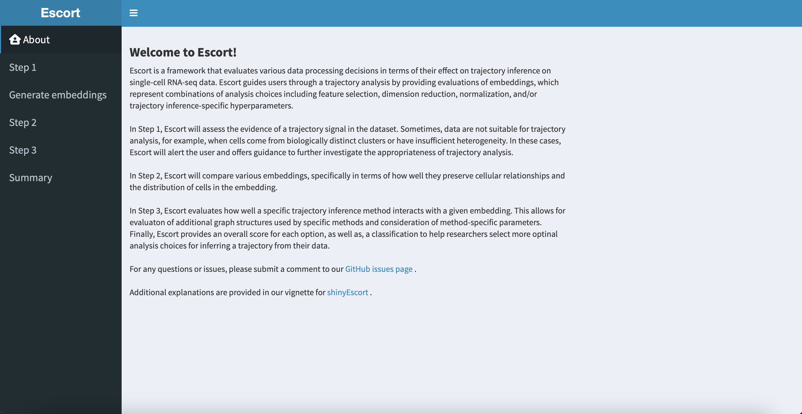
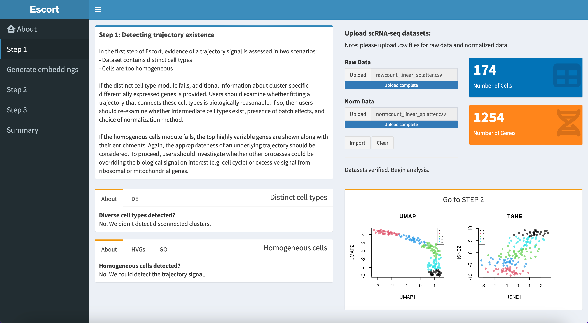
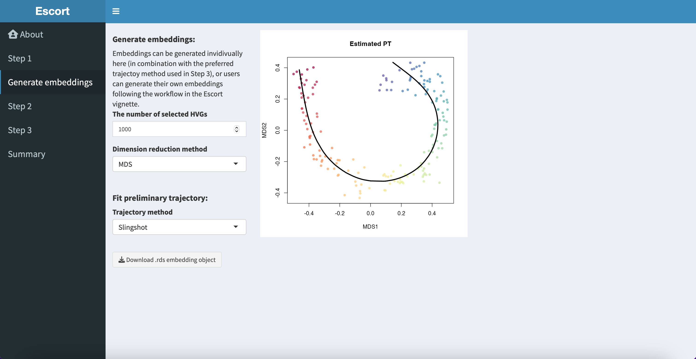
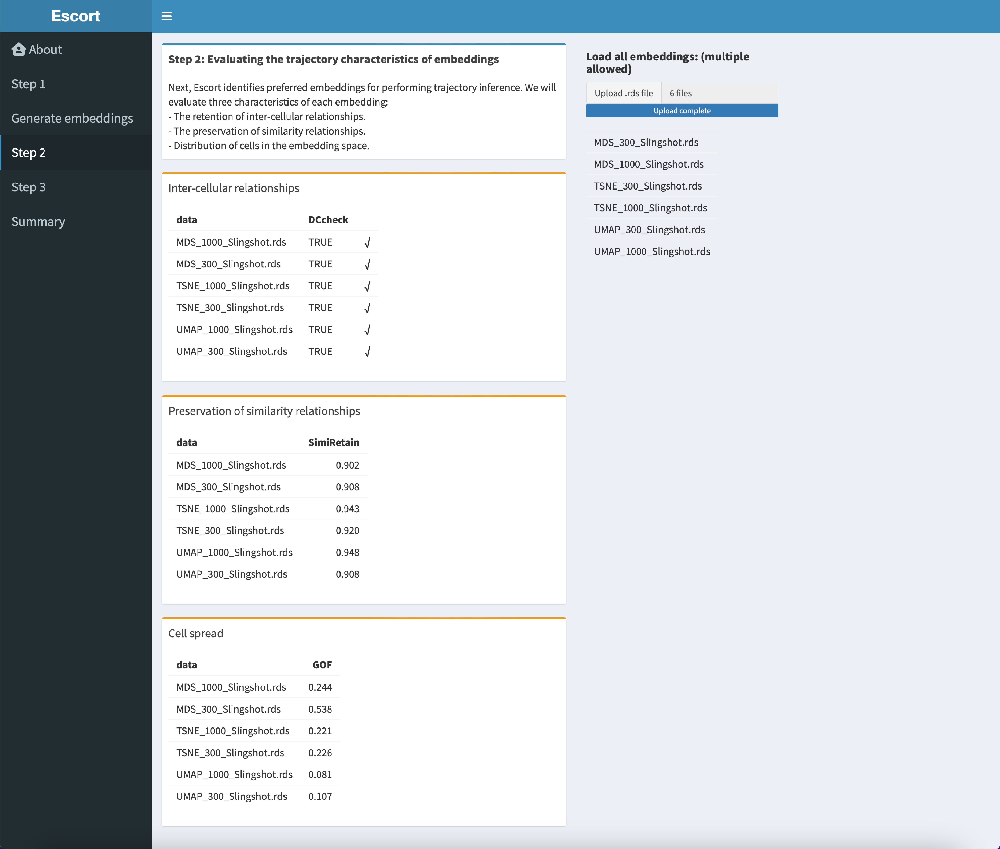
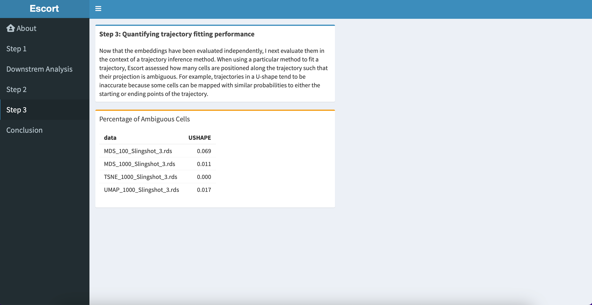
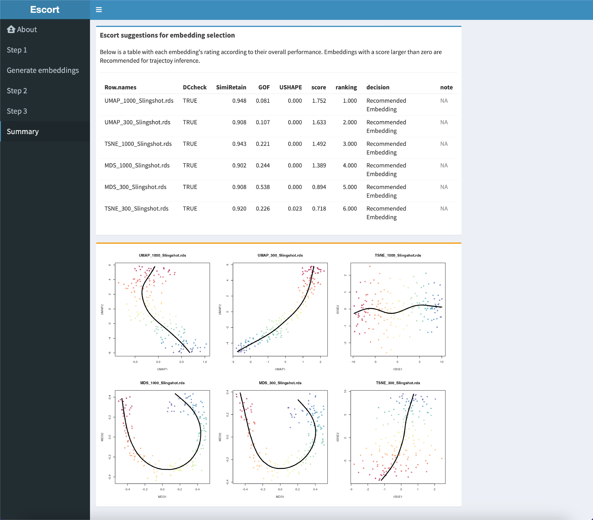

### Introduction
Welcome to shinyEscort, a user-friendly Shiny application designed to help researchers, even those without coding experience, in gaining deeper insights from their data. With shinyEscort, you can input your original data, normalized data, embeddings, and estimated trajectory, making it a valuable tool for understanding your data and obtaining accurate trajectory results.

### About
Discover how shinyEscort operates on the "About" tab positioned within the left column sidebar, offering insights into analysis choices such as feature selection, dimension reduction, and trajectory inference methods. 

### Step1
To initiate the analysis assessing the data's support for trajectory existence, users can click on the "Step 1" button in the left column sidebar. The user inputs cleaned raw and normalized single-cell RNA-seq data in preformatted CSV files and then click “Import” button. Escort checks if the datasets share the same dimensions and showing the number of genes and cells in the dataset; if qualified, it proceeds to assess trajectory feasibility. 
 
 
Two scenarios deemed inappropriate for trajectory fitting include cells from biologically distinct clusters and sets of cells with insufficient heterogeneity. The outcomes are displayed in boxes on the left, while UMAP and t-SNE representations visualize the datasets on the right. If the dataset fails the evaluation, such as detecting distinct clusters, differential expression analysis ensues via the edgeR R package, identifying the top 30 differentially expressed genes between pairwise clusters. Additionally, for datasets demonstrating homogeneity, a compilation of highly variable genes is presented, followed by Gene Ontology (GO) enrichment analysis for a comprehension of biological processes.

### Downstream Analysis
Customize your dimension reduction by choosing techniques like UMAP, MDS, or TSNE. Specify the number of highly variable genes, and by default, Escort fits a trajectory using Slingshot. Visualize the embedding and trajectory on the left, and click "Download Trajectory" to save the embedding and trajectory information as an .rds file for further analysis.

### Step2:
Transition to Step 2, where users upload the .rds files generated in the downstream analysis. Escort evaluates embeddings based on inter-cellular relationships, preservation of similarity relationships, and cell density, presenting results in tables. 

### Step3
Utilizing the embedding-specific trajectory, Escort estimates the proportion of cells with ambiguous projections along the trajectory, displaying the results in a table.

### Conclusion
Based on the three-step evaluation, Escort establishes a realistic and standardized benchmark scoring system ranging from negative infinity to two. Higher scores indicate better performance. Embeddings with a score greater than zero are recommended, while those with a score less than or equal to zero are considered non-recommended. Users can easily identify optimal embedding choices for constructing a trajectory through this scoring system. The conclusive results, featuring embeddings and trajectories, are presented in a table sorted by score. Additionally, a visual representation of the top 6 highest-scoring embeddings and trajectories is plotted below the table for enhanced insight.

